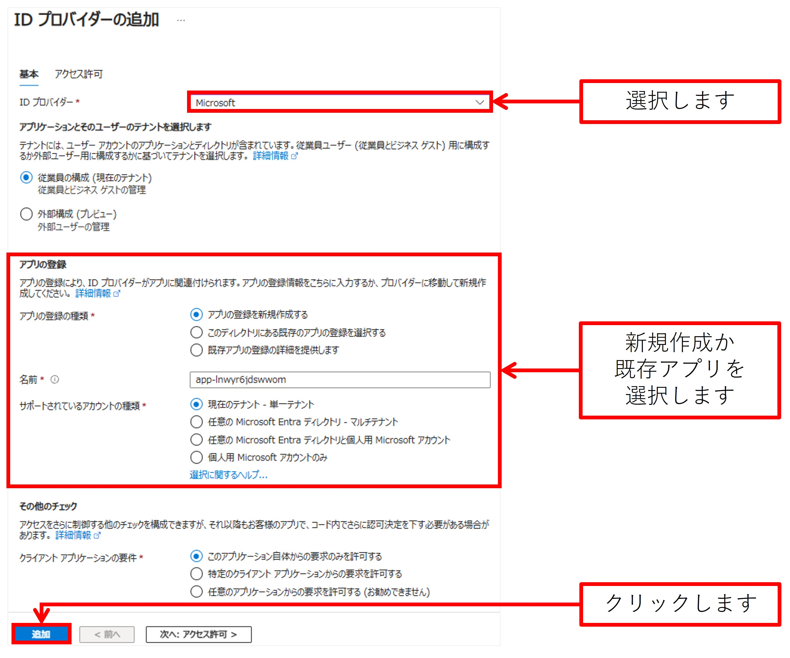

# Azure Speech Service - Text to Speech Avatar
このリポジトリでは [Azure AI Speech Service の Text to Speech Avatar](https://learn.microsoft.com/ja-jp/azure/ai-services/speech-service/text-to-speech-avatar/what-is-text-to-speech-avatar) と Azure OpenAI Service の テキスト生成の機能を用いた、音声で AI と対話を行うことができるアプリのサンプルです。

### Azure へのデプロイ
以下のボタンをクリックすることで、Web アプリケーション動作に必要な Azure リソースをデプロイし、またWeb アプリケーションを Azure Web Apps へデプロイしてくれます。  
[](https://portal.azure.com/#create/Microsoft.Template/uri/https%3A%2F%2Fraw.githubusercontent.com%2Fmahiya%2Fsample-avatar-chat-app%2Fmain%2Fdeploy%2Fazuredeploy.json)

[Deploy to Azure] ボタンをクリックすると、Azure Portal のカスタムデプロイのページが表示されます。

#### 基本情報の指定
以下を情報を指定します。Azure OpenAI Service のアカウントは既存のものを使用するため、事前に作成しておく必要があります。
- Azure リソースをデプロイする先の [Azure サブスクリプション]
- Azure リソースをデプロイする先の [リソースグループ]
- 回答生成に使用する Azure OpenAI Service アカウントのエンドポイント
- 回答生成に使用する Azure OpenAI Service アカウントのキー
- 回答生成に使用する Azure OpenAI Service アカウントにおけるデプロイの名前 (モデル名ではなくデプロイ名, 例: gpt-4o)
- テキストのベクトル化にに使用する Azure OpenAI Service アカウントにおけるデプロイの名前 (モデル名ではなくデプロイ名, 例: text-embedding-3-large)

> 参考: [操作方法: Azure OpenAI Service リソースを作成してデプロイする - Azure OpenAI | Microsoft Learn](https://learn.microsoft.com/ja-jp/azure/ai-services/openai/how-to/create-resource?pivots=webportal)  

#### (任意) Bing Search API に関する情報の指定
もし回答生成の情報源として Bing Search API ([Bing Web Search API](https://learn.microsoft.com/en-us/bing/search-apis/bing-web-search/overview), [Bing News Search API](https://learn.microsoft.com/en-us/bing/search-apis/bing-news-search/overview)) を使用する場合は以下を指定します (任意)
- Bing Search リソースの API キー

> 参考: [Create Bing Search Services Resource - Bing Search Services | Microsoft Learn](https://learn.microsoft.com/ja-jp/bing/search-apis/bing-web-search/create-bing-search-service-resource)

#### デプロイの実行

必要な情報を入力したら、[確認と作成]ボタンをクリックします。

[作成]ボタンをクリックして、デプロイを開始します。デプロイを開始すると、以下の Azure サービスのリソースのデプロイが行われます。
- Azure Web Apps (Web アプリケーションの稼働)
- Azure App Service Plan (上記　Azure Web Apps アプリのホスト)
- Azure Application Insights (Web アプリケーションの監視とログ管理)
- Azure Cosmos DB (会話履歴の管理)
- Azure AI Search (RAGに使用するドキュメントの管理)
- Azure AI Speech Service (音声認識, 音声合成, アバター表示)

### デプロイした Web アプリケーションの利用
Azure Web Apps へデプロイした Web アプリケーションへアクセスするために、デプロイ先の Azure リソースグループのページを表示し、デプロイした Azure Web Apps アプリの名前をクリックします。


Azure Web Apps アプリのページが表示されたら、画面上部の[参照]をクリックします。


デプロイしたチャットアプリが表示されます。  
デプロイ完了からアクセスまでが早すぎる場合、アプリケーションのアクティベーションが完了してなく、既定の Azure Web Apps ページが表示される場合があります。その場合はしばらく待ってから Web アプリケーションへアクセスしてください。

### デプロイした Web アプリケーションを認証で保護する
Azure Web Apps の Easy Auth 機能を使うことで、デプロイした Web アプリケーションに対して、ユーザ認証されたユーザのみがアクセス可能とさせることができます。今回は Microsoft Entra での認証を設定する方法を説明します。デプロイした Azure Web Apps リソースのページを表示して、サイドメニューの[認証]をクリックし、表示されたページの[ID プロバイダーを追加]をクリックします。


[ID プロバイダー]に ```Microsoft``` を選択し、[アプリの登録]にはアプリの新規登録が可能であれば既定で入力されている値を使用、新規登録ができないのであれば、事前に Microsoft Entra でアプリ登録したものを選択してください。そして、[追加]ボタンをクリックします。認証設定の反映には数分かかることがあります。

> 参考: [Microsoft Entra 認証を構成する - Azure App Service | Microsoft Learn](https://learn.microsoft.com/ja-jp/azure/app-service/configure-authentication-provider-aad?tabs=workforce-configuration)



Web アプリケーションへアクセスすると、Web アプリケーションがログインユーザの一部情報を使用することを許諾するページが表示されます。[承諾]をクリックすると、チャットアプリが使えるようになることが分かります。また、シークレットブラウズ等でアクセスすると、認証を求められることが分かります。


## 開発環境での実行

### 設定ファイルの用意
```.env_template```ファイルをコピーして、```.env```ファイルを生成します。  
そして、```.env```ファイルのうち、以下のパラメータを設定します。
- APPLICATIONINSIGHTS_CONNECTION_STRING
- OPENAI_ENDPOINT
- OPENAI_API_KEY
- OPENAI_MODEL
- OPENAI_TEMPERATURE
- COSMOS_CONNECTION_STRING
- COSMOS_DB_NAME
- COSMOS_CONTAINER_NAME
- AI_SEARCH_ENDPOINT
- AI_SEARCH_QUERY_KEY
- AI_SEARCH_INDEX_NAME
- SPEECH_SERVICE_KEY
- SPEECH_SERVICE_REGION
- BING_SEARCH_API_KEY (任意)

### Python パッケージのインストール

#### (任意) Python 仮想環境の用意
必要に応じて、Python の仮想環境を構築します。以下は、venv を使った構築方法です。```.venv```という名前の仮想環境を構築しています。
```sh
python -m venv .venv
```

以下のコマンドで、仮想環境を有効化できます。
```sh
source .venv/Scripts/activate

# Power Shell の場合は以下の通り
# > . .\venv\Scripts\Activate.ps1
```

#### パッケージのインストール
以下のコマンドで、必要な Python パッケージをインストールします。
```sh
python -m pip install -r requirements.txt
```

### Web アプリケーションの実行
以下のコマンドで、Web アプリケーションを実行します。
```sh
python app.py
```

[http://127.0.0.1:5000](http://127.0.0.1:5000) へアクセスすることで、ローカルで起動している Web アプリケーションへアクセスできます。

## ローカルで修正した Web アプリケーションの Azure へのデプロイ
修正した Web アプリケーションを Azure 環境へ反映させる方法は以下の通りです。

### Azure Web Apps のデプロイ設定の変更
デプロイした Azure Web Apps リソースのページを表示し、サイドメニューの[デプロイメント]>[デプロイ センター]をクリックします。  
すると、Web Apps のデプロイ設定が表示されるので、[ソース]欄の "外部 Git" と書いてある下にある[切断]リンクをクリックします。  
"デプロイとの接続を切断しますか?"と表示されるので、[OK]ボタンをクリックします。  
この作業を行うことで、Web Apps はデプロイされているコードを格納している GitHub リポジトリ [mahiya/sample-avatar-chat-app](https://github.com/mahiya/sample-avatar-chat-app) との接続が解除されるため、そのリポジトリのコード以外を、この Web Apps リソースにデプロイできるようになります。

### Azure Web Apps へのデプロイ
[deploy.sh](deploy.sh)の以下のパラメータを修正します。
- RETION
- RESOURCE_GROUP
- APP_SERVICE_PLAN_NAME
- APP_SERVICE_NAME

そして、以下の通りに [deploy.sh](deploy.sh) を実行することで、ローカルで修正したコードを Azure 環境へ反映させることができます。  
スクリプト実行後、反映には時間がかかる場合があります。
```
./deploy.sh
```